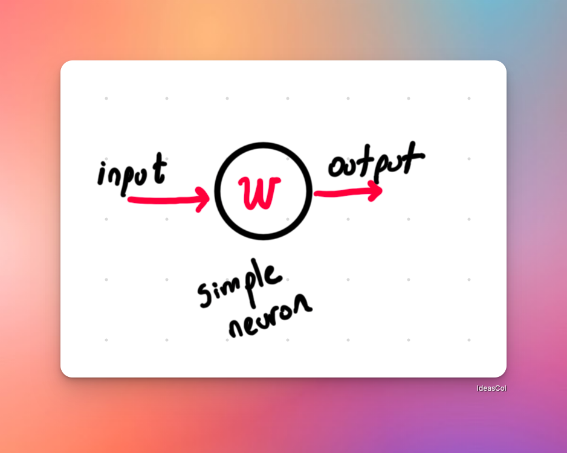

# Red neuronal simple

Una neurona es un componente básico de una red neuronal. Es una sobresimplificación de una neurona real, donde cada neurona tiene 2 componentes:

- Un peso (weight): Un valor que representa la importancia de la entrada.
- Un sesgo (bias): Un valor que representa la influencia externa sobre la neurona.

La neurona recibe una entrada (input) y produce una salida (output) a través de una función de activación (en este caso, la función sigmoide).

```typescript
const sigmoid = (x: number): number => 1 / (1 + Math.exp(-x));
```

Básicamente, la función sigmoide es un mecanismo que "normaliza" el valor de la entrada, lo que significa que la salida de la neurona se encuentra entre 0 y 1. Esto es importante porque permite que la red neuronal produzca valores que puedan ser interpretados como probabilidades. Si quieres saber mas acerca puedes ver la explicación en el archivo [sigmoid-function.md](/1-neural-example/sigmoid-function.md).

La neurona se vería de la siguiente manera:

```typescript
const neuron = (x: number, w: number, b: number): number => {
  const z = w * x + b;
  return sigmoid(z);
};

```

Donde:

- `x` es la entrada, que es un valor que se multiplica por el peso
- `w` es el peso, que es un valor que se multiplica por la entrada
- `b` es el sesgo, que es un valor constante que se suma a la entrada



Ejemplo de uso:

```typescript
const input = 1.0;
const weight = 0.8;
const bias = 0.2;

const output = neuron(input, weight, bias);
console.log("Salida de la neurona:", output);
```

---

## Todo junto

```typescript
// neurona.ts
const sigmoid = (x: number): number => 1 / (1 + Math.exp(-x));

const neuron = (x: number, w: number, b: number): number => {
  const z = w * x + b;
  return sigmoid(z);
};

// ejemplo de uso
const input = 1.0;
const weight = 0.8;
const bias = 0.2;

const output = neuron(input, weight, bias);
console.log("Salida de la neurona:", output); // Salida de la neurona: 0.7310585786300049

```

eso es todo! por ahora, una neurona solo se ve como una sencilla función, que ante una entrada dada, produce una salida. Ese sencillo artefacto es la base de una red neuronal, que es una colección de neuronas que trabajan juntas para resolver un problema. Es increible que algo tan sencillo pueda resolver problemas tan complejos como la clasificación de imágenes, la predicción del precio de una casa, o la detección de fraudes en tarjetas de crédito, o si ella te está usando... 🤣

