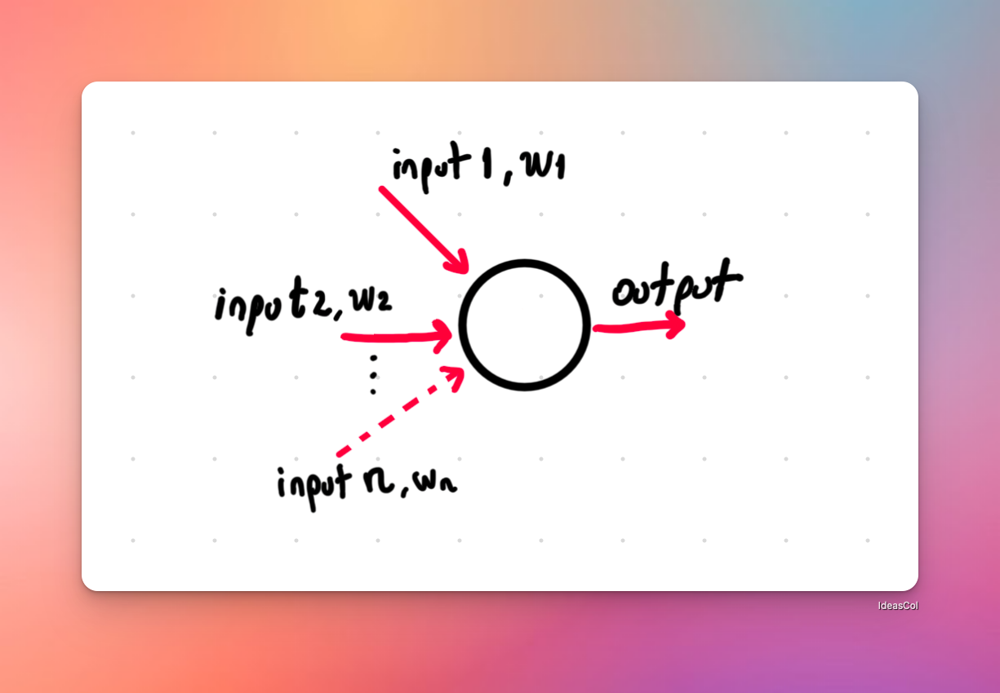
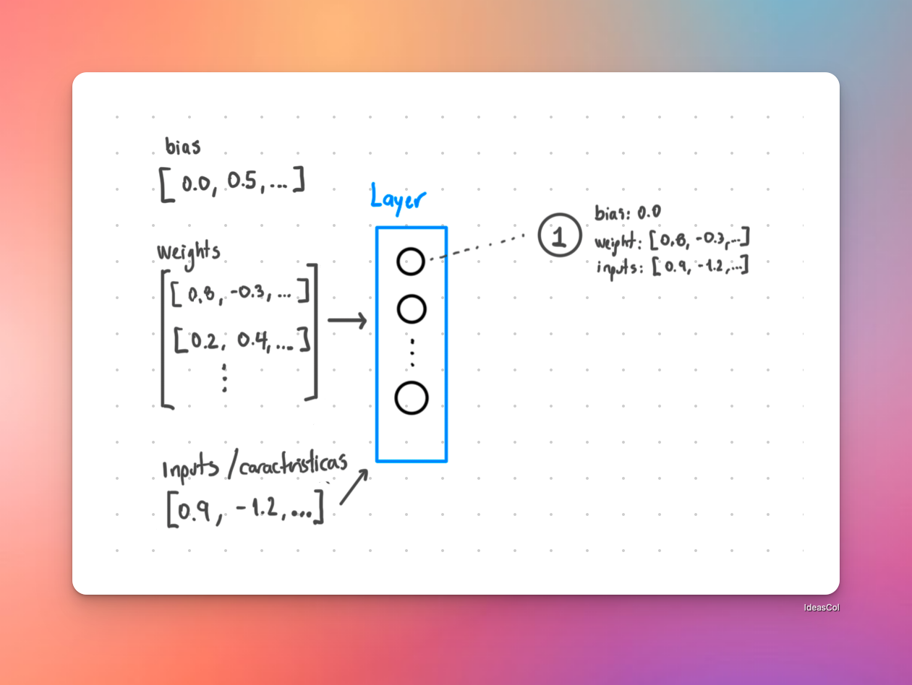
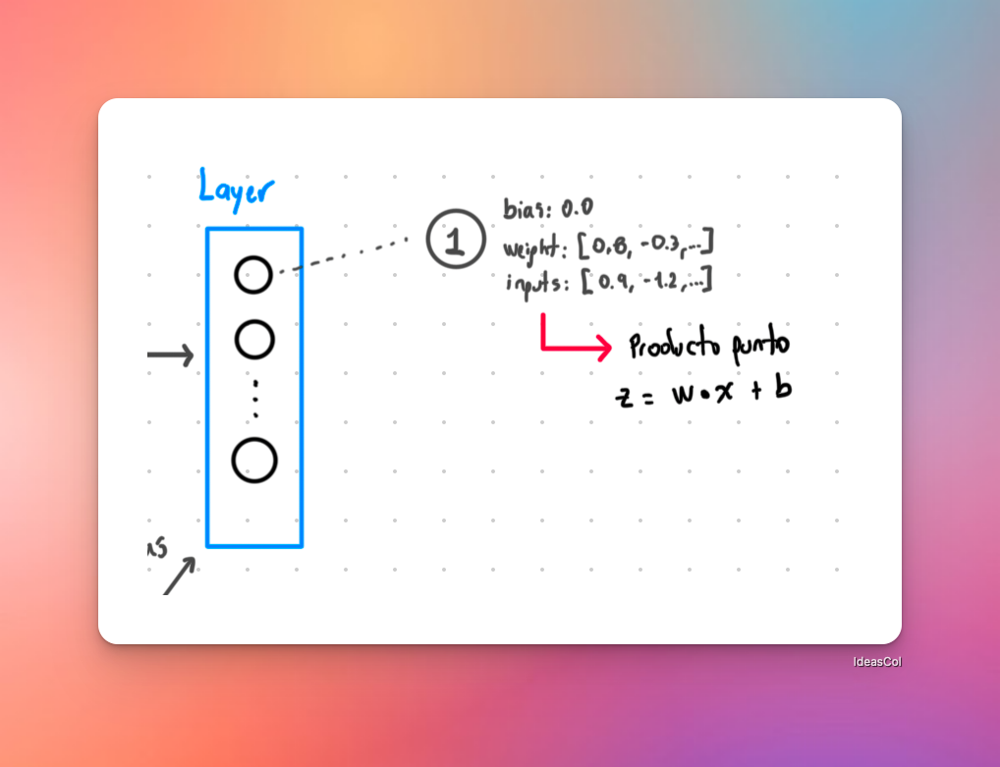

Ya que ya tenemos una neurona, que tal si hacemos algo interesante? veamos el concepto de **Layer** (capa).

Cual sería la lógica de un layer?

1. Una capa recibe una entrada que puede venir directamente de los datos originales (en el caso de la capa de entrada) o de la salida de una capa anterior.
2. Cálculo de Ponderaciones (Pesos) y Sesgo (Bias)
3. Cálculo de la salida

Antes de continuar, debemos expandir el concepto de **Neurona** para que pueda recibir una lista de entradas. Ya que en la realidad una neurona recibe interacciones de múltiples neuronas, entonces, podriamos verlo así:

Adicional, veamos como seria la definicion de un Layer sin código para entender mejor:

Cada neurona recibe una lista de entradas, y produce una salida. Para ello hacemos uso del **producto punto** (mira [producto punto](/neural-network/producto-punto)) para obtener la suma ponderada de las entradas, y luego aplicamos la función de activación (en este caso, la función sigmoide).

